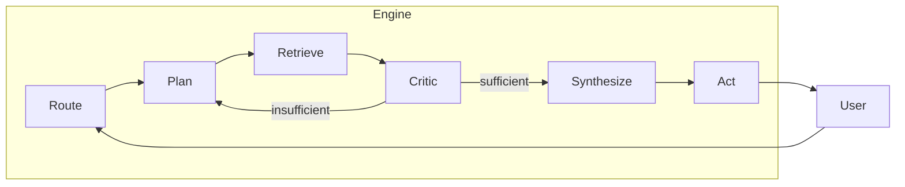

# Pattern Playbook: Actor-Critic RAG Agent

## Overview

The Enterprise AI Agent Framework implements an **Actor-Critic** pattern for building production-grade Retrieval-Augmented Generation (RAG) agents. This pattern provides deterministic orchestration, quality control through a critic loop, and safe tool execution.

## Architecture



## Loop Modes

| Mode | Steps | Use Case |
|------|-------|----------|
| `fast_rag` | Retrieve → Synthesize | Simple lookups, latency-sensitive |
| `plan_rag` | Plan → Retrieve → Synthesize | Standard Q&A with query decomposition |
| `full_actor_critic` | Plan → Retrieve → Critic → Synthesize | Complex questions needing refinement |
| `action_gated` | Full + Act | Questions requiring tool execution |

## Key Principles

### 1. Orchestration Ownership (Option A)
The **AgentWorkflowEngine** owns all orchestration decisions. LLMs are called for specific steps (plan, synthesize, etc.) but cannot skip steps or change the flow.

### 2. Critic as Quality Gate
The critic evaluates retrieval sufficiency before synthesis. This prevents:
- Hallucinations from insufficient context
- Low-quality answers that require follow-up
- Wasted tokens on poor responses

### 3. Router as Advisor, Not Controller
The router (Classic or MAF) returns a `RouteDecision` with recommendations. The engine enforces `allowed_modes` from config—the router cannot exceed these bounds.

### 4. Tools Require Approval
In `action_gated` mode, tool execution follows a confirmation flow:
1. Propose action with details
2. Wait for approval (unless `auto_approve_dev` is true)
3. Execute with idempotency key
4. Log result with full tracing

## Configuration

All behavior is controlled via `agent.yaml`:

```yaml
workflow:
  default_mode: plan_rag
  allowed_modes: [fast_rag, plan_rag, full_actor_critic]
  budget:
    max_iterations: 2
    max_latency_ms: 8000

retrieval:
  type: ai_search
  ai_search:
    index_name: idx-confluence
    default_top_k: 5
```

## Tracing

Every step creates an OpenTelemetry span:
- `agent.route`
- `agent.plan`
- `agent.retrieve`
- `agent.critic`
- `agent.synthesize`
- `agent.tool_call.<tool_name>`

## Next Steps

- [Developer Pathway](DEVELOPER_PATHWAY.md) - Getting started
- [Config Reference](CONFIG_REFERENCE.md) - Full configuration options
- [Observability Spec](OBSERVABILITY_SPEC.md) - Tracing and monitoring
